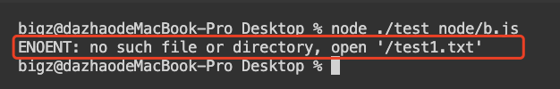
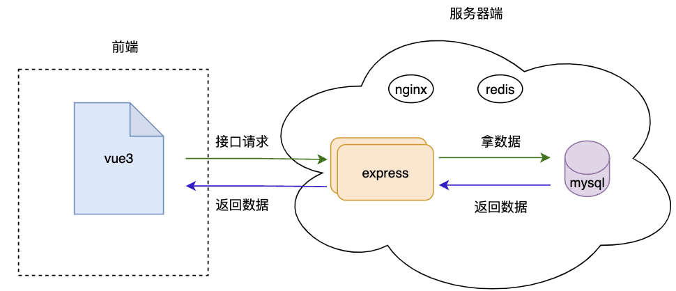
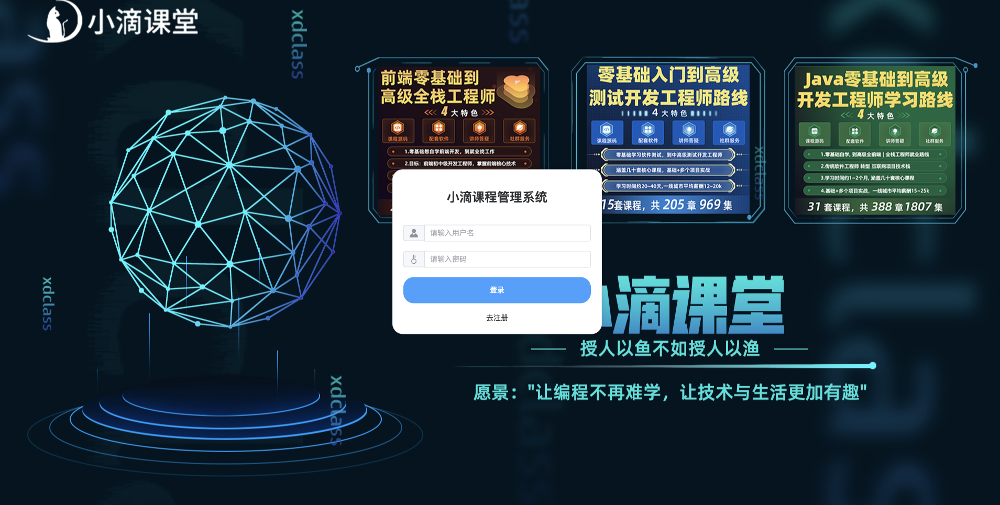
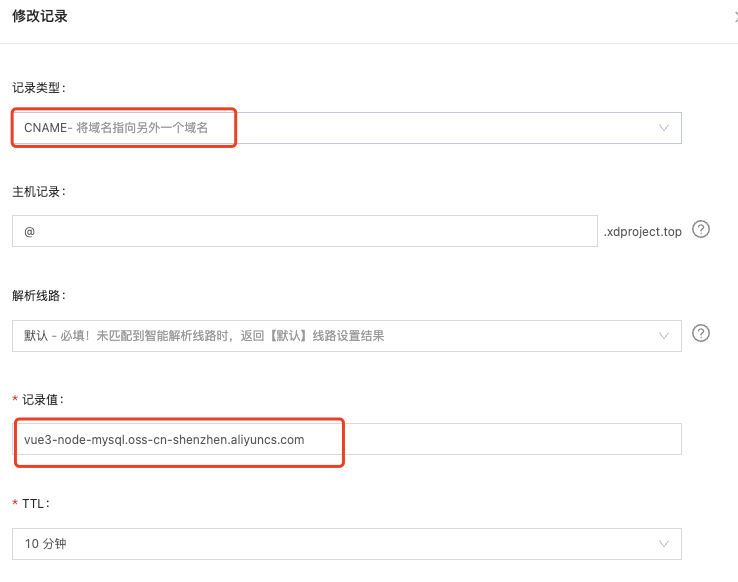

 **愿景："让编程不再难学，让技术与生活更加有趣"**

**更多课程请访问 xdclass.net**

### 第一章 vue3+Node+mysql全栈项目课程介绍

#### 第1集 vue3+Node+mysql全栈项目课程介绍+适合人员+学后水平

**简介：课程介绍，适合人员和学后水平**

- 适合人群

  - 进阶前端高级开发工程师
  - 进阶全栈开发工程师

  - 后端开发工程师

    ​		

- 学后水平

  - 【node】node.js搭建http服务 | express框架搭建服务 | 开发接口 | CORS、JSONP跨域 | JWT登录认证 | 操作数据库

  - 【vue3】vue3的setup语法糖 | element-plus使用和二次封装 | axios二次封装 | vue-router | 事件订阅发布miit

  - 【mysql】mysql容器化安装、运行 | sql语句使用 | sequel pro | 数据库初始定义 |服务器部署

  - 【docker】docker快速入门使用 | 镜像拉取 | 容器生成 | 极简安装mysql服务

  - 【阿里云服务器】服务器购买 | 使用操作 | 终端、FileZilla远程连接服务器操作

  - 【阿里云服务器】域名购买备案 |vue3项目部署 | node项目部署 | 项目上线 

    

- 项目实战演示

  

- 学习形式

  - 视频讲解 + 文字笔记 + 代码分析 + 交互流程图

  - 配套源码 + 笔记 + 课程软件 + 技术交流群 + 答疑


​                                                                 


#### **第2集 全栈项目课程大纲速览**

**简介：大纲速览**

- 课程大纲速览


**愿景："让编程不再难学，让技术与生活更加有趣"**

**更多课程请访问 xdclass.net**

### 第二章 Node基础—走进Node的世界

#### 第1集 认识Node—使用Javascript做后端开发

**简介：运行环境Node**

- 定义

  - Node.js是一个基于Chrome V8 引擎的 JavaSript 的运行环境

    ```
    前端开发——JavaSript代码运行在浏览器当中    Dom、Bom、js第三方库
    后端开发——JavaSript代码运行在Node环境当中  js第三方库
    ```

  

  

  

  - Node 官网地址

    - http://nodejs.cn/

  

  


#### 第2集 认识Node—安装Node

**简介：安装Node**

-  mac电脑安装


- windows电脑安装

  - https://www.yuque.com/u1106272/cai80g/ww4zpx

- 查看Node版本 

  ```
  node -v
  ```

  


#### 第3集 上手Node—Node环境执行js代码

**简介：使用Node环境执行js代码**

- 使用Node运行Javascript代码

  - 创建test_node文件夹

  - 用vscode打开

  - 创建test.js文件

    ```js
    // test.js
    console.log('hello，node')
    ```

  - 运行命令

    ```
    node test.js
    ```

  

- 安装nodemon工具实现热更新

  - 检测到目录中的文件更改时自动重启应用

    ```
    npm i nodemon -g
    ```

    ```
    nodemon test.js
    ```

    


#### 第4集 认识Node—理解commonjs模块规范

**简介：commonjs模块规范**

- commonjs

  - commonjs 是一种使用广泛的 JavaScript 模块化规范，核心思想是通过 require 方法来同步地加载依赖的其他模块，通过 module.exports 导出需要暴露的接口

  - 使用演示

    ```js
    //a.js
    const xd = '小滴课堂';
    
    function fun() {
      console.log('你好,commonjs');
    }
    
    module.exports = {
      xd,
      fun,
    };
    ```

    ```js
    //b.js
    const aData = require('./a');
    aData.fun();
    console.log(aData.xd);
    ```

- JavaScript中为什么要使用commonjs？

  - js没有模块系统，不具备封闭的作用域和依赖管理

  - 缺少文件系统的IO流API

  - 不具备包管理系统

    

- commonjs 和 ES6 模块的区别
  - commonjs 模块输出的是一个值的拷贝，ES6 模块输出的是值的引用
  - commonjs 模块是运行时加载，ES6 模块是编译时输出接口
  - commonjs  模块的 require() 是同步加载模块，ES6 模块的 import 命令是异步加载，有一个独立的模块依赖的解析阶段


**愿景："让编程不再难学，让技术与生活更加有趣"**

**更多课程请访问 xdclass.net**

### 第三章 Node基础—核心模块之文件系统fs模块使用

#### 第1集 fs模块—读取文件内容

**简介： 详解 `fs ` 读取文件内容**

- 什么 fs 模块

  - node提供用来操作文件的内置模块，模块里有很多的属性和方法，用于处理文件，如：文本，图片，视频，音频等等

- fs 读取文件内容

  - 方法

    ```js
    // path:路径
    // options:编码格式
    // callback:回调函数
    fs.readFile(path,options,callback)
    ```

  - 使用

    ```js
    const fs = require('fs')
    
    fs.readFile('./test.txt', 'utf8' , (err, data) => {
      // 如果读取成功，err的值为nul，失败时，err的值为错误对象
      if (err) {
        console.error(err)
        return
      }
      console.log(data)
    })
    ```

- 注意

  - fs.readFile() 返回数据之前将文件的全部内容读取到内存中，因此对于大文件最好使用流（Stream模块）来读取文件的内容


#### 第2集 fs模块—写入文件内容

**简介： 详解 `fs ` 写入文件内容**

- 写入文件内容 fs.writeFile()

  - 方法

    ```js
    // path:路径
    // content:写入内容
    // callback:回调函数
    fs.writeFile(path,content,callback)
    ```

  - 使用

    ```js
    const fs = require('fs')
    
    const content = '写入的内容'
    
    fs.writeFile('./text.txt', content, err => {
      // 如果读取成功，err的值为nul，失败时，err的值为错误对象
      if (err) {
        console.error(err)
        return
      }
      console.log('文件内容写入成功')
    })
    ```

- 追加文件内容 fs.appendFile()

  - 方法

    ```js
    // path:路径
    // content:写入内容
    // callback:回调函数
    fs.appendFile(path,content,callback)
    ```

  - 使用

    ```js
    const content = '追加的内容'
    
    fs.appendFile('./test.txt', content, err => {
      if (err) {
        console.error(err)
        return
      }
       consloe.log('文件内容追加成功')
    })
    ```

    

- fs 模块的其他方法

  - http://nodejs.cn/learn/the-nodejs-fs-module


#### 第3集 fs模块—个人信息表案例

**简介：个人信息表的练习**

- 练习

  ```js
  // text.txt
  姓名-老王
  年龄-30岁
  婚否-已婚
  特征-邋遢
  ```
  
  需求：将 - 改为 :
  
  
  
- 实现

  ```js
  const fs = require('fs');
  
  fs.readFile('./test1.txt', 'utf8', (err, data) => {
    if (err) {
      console.error(err);
      return;
    }
    const newList = [];
    data.split('\n').map((i) => {
      newList.push(i.replace('-', ':'));
    });
    content = newList.join('\n');
    fs.writeFile('./test1.txt', content, (err) => {
      if (err) {
        console.error(err);
        return;
      }
      console.log('文件写入成功');
    });
  });
  ```


**愿景："让编程不再难学，让技术与生活更加有趣"**

**更多课程请访问 xdclass.net**

### 第四章 Node基础—核心模块之路径模块path使用

#### 第1集 文件路径—解决相对路径的问题

**简介：解决动态拼接路径的问题**

- 使用相对路径的问题

  - 执行启动node进程时，是以当前终端的路径进行拼接代码中的相对路径

  - 当前路径有出入时，会出现路径拼接错误

    

- 使用绝对路径解决

  ```js
  fs.readFile('/Users/bigz/Desktop/test_node/test.txt', 'utf8' , (err, data) => {
    // 如果读取成功，err的值为nul，失败时，err的值为错误对象
    if (err) {
      console.error(err)
      return
    }
    console.log(data)
  })
  ```

  

- 绝对路径的代指字段

  ```js
  fs.readFile(__dirname + '/test.txt', 'utf8' , (err, data) => {
    // 如果读取成功，err的值为nul，失败时，err的值为错误对象
    if (err) {
      console.error(err)
      return
    }
    console.log(data)
  })
  ```

  

​		


#### 第2集 path模块—认识path路径模块和使用

**简介：path路径模块使用**

- 路径的拼接 path.join()

  - 方法

    ```js
    // 路径的个数没限制
    const path=path.join('a','b','c')
    console.log(path) // a/b/c
    ```

  - 使用

    ```js
    fs.readFile(path.join(__dirname,'/test.txt'), 'utf8' , (err, data) => {
      // 如果读取成功，err的值为nul，失败时，err的值为错误对象
      if (err) {
        console.error(err)
        return
      }
      console.log(data)
    })
    ```


#### 第3集 path模块—文件路径和扩展名的获取

**简介：文件路径和扩展名的获取**

- 获取路径中的最后一部分 path.basename()

  ```js
  require('path').basename('/test/something') //something
  require('path').basename('/test/something.txt') //something.txt
  require('path').basename('/test/something.txt', '.txt') //something
  ```

- 获取路径中的目录部分 dirname()

  ```js
  require('path').dirname('/test/something') // /test
  require('path').dirname('/test/something/file.txt') // /test/something
  ```

- 获取路径中的扩展名部分 extname()

  ```js
  require('path').extname('/test/something') // ''
  require('path').extname('/test/something/file.txt') // '.txt'
  ```

  

- path 模块的其他方法
  - http://nodejs.cn/learn/the-nodejs-path-module/#pathbasename


**愿景："让编程不再难学，让技术与生活更加有趣"**

**更多课程请访问 xdclass.net**

### 第五章 Node基础—核心模块之网络模块http使用

#### 第1集 http模块—快速理解超文本传输协议 http 

**简介：快速理解超文本传输协议 http **

- 什么是http协议
  * 即超⽂本传送协议，是Web联⽹的基础，也是移动或PC联⽹常⽤的协议之⼀，HTTP协议是建⽴在TCP协议之上的⼀种应⽤
  * HTTP连接最显著的特点是客户端发送的每次请求都需要服务器响应请求，从建⽴连接到关闭连接的过程称为“⼀次连接”
  * HTTP请求-HTTP响应


- http 消息结构（报文）

  - 请求报文

    

    ```
    请求行：请求方法 URL地址 协议名
    
    请求头：报文头包含若干个属性，格式为“属性名:属性值”，服务端据此获取客户端的基本信息
    
    请求体：请求的参数，可以是json对象，也可以是前端表单生成的key=value&key=value的字符串
    ```

    

  - 响应报文

  - 

    ```
    响应行：报文协议及版本 状态码
    
    响应头：报文头包含若干个属性，格式为“属性名:属性值”
    
    响应正文：响应报文体，我们需要的内容，多种形式比如html、json、图片、视频文件等
    ```

    

- 请求方法

  - GET: 向服务器获取资源，比如常见的查询请求

  - POST: 向服务器提交数据而发送的请求

  - Head: 和get类似，返回的响应中没有具体的内容，用于获取报头

    

- 状态码

  * 1XX
    * 100 收到请求，需要请求者继续执行操作，比较少用
    * 101 切换请求的协议

  * 2XX: 请求成功，常用的 200

  * 3XX: 重定向，浏览器在拿到服务器返回的这个状态码后会自动跳转到一个新的URL地址，这个地址可以从响应的Location首部中获取；

    * 好处：网站改版、域名迁移等，多个域名指向同个主站导流

    * 必须记住：
      301：永久性跳转，比如域名过期，换个域名
      302：临时性跳转

      304：数据已经在客户端缓存，不需要请求更多的数据

  * 4XX: 客服端出错，请求包含语法错误或者无法完成请求

    * 必须记住：
      400: 请求出错，比如语法协议
      403: 没权限访问
      404: 找不到这个路径对应的接口或者文件
      405: 不允许此方法进行提交，Method not allowed，比如接口一定要POST方式，而你是用了GET

  * 5XX: 服务端出错，服务器在处理请求的过程中发生了错误
    * 必须记住：
      500: 服务器内部报错了，完成不了这次请求
      503: 服务器宕机


#### 第2集 http模块—剖析Node中http模块相关知识点

**简介：Node中http模块相关知识点 **

- Node中http模块相关知识点

  - http模块

    - 是Node.js 网络的关键模块，用来创建web服务器，通过 http.createServer() 就能将普通的电脑变成本地的web服务器

  - ip

    - 在互联网中每个服务器都有一个唯一的ip地址，本地服务器ip地址为：127.0.0.1

    - 在开发环境下，自己的电脑既是客户端也是服务器，浏览器输入http://127.0.0.1:3000就能访问

  - 域名
    - 由于ip地址不直观，不方便记忆，诞生了域名地址来替换ip地址访问
    - iP地址和域名是一对多的关系，对应关系在域名服务器中（DNS）保存

  - 端口
    - 端口就像是银行的办事窗口，每个窗口可以提供不同的服务，银行就是服务器

​			


#### 第3集 http模块—创建一个本地的web服务器

**简介：创建一个本地的web服务器**

- http模块创建服务器

  ```js
  //引入http模块
  const http = require('http');
  
  //创建服务器
  const server = http.createServer();
  
  //监听客户端的请求
  server.on('request', (req, res) => {
    const mess = `请求地址：${req.url},请求方法:${req.method}`;
    //解决中文乱码的问题
    res.setHeader('Content-Type', 'text/html;charset=utf-8');
    //响应的内容和结束本次请求
    res.end(mess);
  });
  
  //启动服务器
  server.listen(3000, () => {
    console.log('服务运行在：http://127.0.0.1:3000');
  });
  ```

  


#### 第4集 http模块—根据请求路径不同返回不同的资源内容

**简介：根据请求路径不同返回不同的资源内容**

- 根据不同url返回不同的内容

  ```js
  //引入http模块
  const http = require('http');
  
  //创建服务器
  const server = http.createServer();
  
  //监听客户端的请求
  server.on('request', (req, res) => {
    //设置默认的返回内容
    let mess = '404 页面请求失败';
    //判断请求的地址
    if (req.url === '/' || req.url === '/home') {
      mess = '<h1>首页</h1>';
    } else if (req.url === 'about') {
      mess = '<h1>关于</h1>';
    }
    res.setHeader('Content-Type', 'text/html;charset=utf-8');
    res.end(mess);
  });
  
  //启动服务器
  server.listen(3000, () => {
    console.log('服务运行在：http://127.0.0.1:3000');
  });
  ```

  


**愿景："让编程不再难学，让技术与生活更加有趣"**

**更多课程请访问 xdclass.net**

### 第六章 Node基础—核心模块之Buffer和Stream模块

#### 第1集 核心模块Buffer—剖析Buffer缓冲区

**简介：剖析Buffer缓冲区**

- Buffer定义
  - Buffer 是内存区域，固定大小的内存块（无法调整大小），可以将 buffer 视为数组，每个元素代表一个数据字节，由Node中Buffer类实现


- Buffer的数据形式

  - 保存在Buffer中的数据是以十六进制的形式展示的，更加简短，但是计算机底层处理的还是二进制数据

    ```js
    const buf = Buffer.from('xdclass')
    console.log(buf)
    
    const buf = Buffer.from('小滴课堂')
    ```

    

    

    ```js
    //内存的单位
    1bit 1位
    8bit = 1byte  1字节
    1024byte = 1kb
    1024kb = 1mb
    1024mb = 1gb
    1024gb = 1tb
    ```

    

-  为什么需要Buffer？

  - 帮助开发者处理二进制数据，传统上数组只处理字符串而不是二进制数据 图片 音视频 

  - 当对文件的IO操作时，输出的速度大于输入的速度，则会将数据存入Buffer中

  


#### 第2集 核心模块Buffer—Buffer的使用

**简介：Buffer的使用**

- Buffer.from(str)

  - 将字符串转成buffer

    ```js
    Buffer.from('xdclass')
    ```

- Buffer.alloc(size)

  - 创建一个指定大小的buffer，无法调整大小

    ```js
    Buffer.alloc(10)
    ```

- Buffer.allocUnsafe(size)

  - 在buffer池中使用原有的buffer，可能含有敏感数据，但是性能会更好

    ```js
    Buffer.allocUnsafe(10)
    ```

- buf.toString()

  - 将buffer转成字符串

    ```js
    const buf = Buffer.from('小滴课堂')
    
    buf.toString()
    ```

    


​	

#### 第3集 核心模块Stream—深入理解Stream 流

**简介：深入理解Stream**

- Stream
  - 是一种以高效的方式处理读/写文件 io、网络通信、或任何类型的端到端的信息交换
  - 在传统的方式中，读取文件时，会将文件从头到尾读入内存（buffer），然后进行处理
  - 使用流，则可以逐个片段地读取并处理（而无需全部保存在内存中）。


#### 第4集 核心模块Stream—Stream的使用

**简介：Stream的使用**

- createReadStream

  - 创建可读流

- createWriteStream

  - 创建可写流

- 实现

  ```js
  const fs = require('fs');
  const path = require('path');
  
  //创建可读流
  const flowa = fs.createReadStream(path.join(__dirname, '/a.txt'));
  //创建可写流
  const flowb = fs.createWriteStream(path.join(__dirname, '/b.txt'));
  //通过pipe建立管道流
  flowa.pipe(flowb);
  
  //监听数据完成流向
  flowa.on('end', () => {
    console.log('数据流向成功');
  });
  ```

  


**愿景："让编程不再难学，让技术与生活更加有趣"**

**更多课程请访问 xdclass.net**

### 第七章 Node进阶—玩转express框架开发《初始篇》

#### 第1集 express框架—深入理解express框架 

**简介：深入理解express框架**

- 定义

  - 基于 Node.js 平台，快速、开放、极简的 Web 开发框架

  - 其实就是node npm包管理工具中的第三方包，可以使用express快捷创建服务器

- 其他的node框架

  - koa2

  - egg

  - nest.js

    

- node 可以通过 http 创建服务器，为什么还需要用express呢？
  - http 内置模块创建服务器比较复杂，降低开发效率
  - express 框架创建服务器是通过 http 模块封装出来的，在创建服务器或者编写接口方面更加简便

 

- 安装

  ```
  cnpm i express@4.17.3
  ```

  

- 创建服务器

  ```js
  const express = require('express');
  
  const app = express();
  
  app.listen(3000, () => {
    console.log('service run in http://127.0.0.1:3000');
  });
  ```


#### 第2集 express框架—监听数据请求和参数处理

**简介：监听数据请求和参数处理**

- get请求

  ```js
  // url：请求地址
  // req：包含请求的属性和方法
  // res：包含响应的属性和方法
  const express =require('express')
  const app= express()
  app.get('/userInfo', (req, res) => {
    // 响应数据处理
    cosole.log(req.query)
    //向客户端响应数据
    res.send('请求成功')
  });
  ```

  

- post请求

  ```js
  // url：请求地址
  // req：包含请求的属性和方法
  // res：包含响应的属性和方法
  const express =require('express')
  const app= express()
  app.post('/login', (req, res) => {
    // 响应数据处理
    cosole.log(req.body)
    //向客户端响应数据
    res.send('请求成功')
  });
  ```


- postman安装使用
  - 接口请求的方法设置
  - 接口请求的参数编写
  - 保存接口信息		


#### 第3集 express框架—路由配置模块化

**简介：上手路由配置**

- express中的路由
  - 前端中的路由 router 一样，在不同的路由页面展示不同的内容
  - express中的路由就是不同路径的接口，响应客户端不同的数据

  
  
- 创建路由模块

  ```js
  // router/user.js
  const express = require('express');
  const router = express.Router();
  // 登录
  router.post('/user/login', (req, res) => {
    res.send('登录');
  });
  
  // 获取用户数据
  router.get('/user/userInfo', (req, res) => {
    res.send('获取用户数据');
  });
  
  module.exports = router;
  ```

- 使用中间件注册路由模块

  ```js
  const router = require('./router/user');
  //使用中间件注册路由模块
  app.use(router);
  ```

  


**愿景："让编程不再难学，让技术与生活更加有趣"**

**更多课程请访问 xdclass.net**

### 第八章 Node进阶—玩转express框架开发《中间件篇》

#### 第1集 express中间件—初识中间件

**简介：初始中间件**

- 中间件

  - 业务逻辑流程中的中间环节

  - 例子

    

    ```
    如果在阀门注入珍珠，那么这个阀门“下游”的所有东西都会含有这个新添加的珍珠原料，仪表就可以监测当前的管道流量；
    
    在 Express 程序中，通过调用 app.use 向管道中插入中间件，比如有些接口需要token验证，则可以使用use()方法插入token校验中间件，或者在业务逻辑的最下游加上错误中间件，根据不同的错误类型抛出对应的错误信息。
    
    对于每一个中间件则需要在执行完逻辑后调用next()，让程序继续往下运行，
    ```

    


#### 第2集 express中间件—全局和局部中间件

**简介：掌握全局和局部中间件**

- 定义中间件函数

  ```js
  // 声明一个中间件
  const middle = (req, res, next) => {
    console.log('一个中间件');
    /**
     * 逻辑处理
     */
  
    //逻辑处理完成后，必须调用next()将程序交给下个中间件或者路由，否则程序停止
    next();
  };
  ```

- 注册全局生效的中间件

  - 只要用户在客户端发起请求，到服务器之后都能生效的中间件

    ```js
    const express = require('express');
    const app = express();
    
    app.use((req, res, next) => {
      console.log('一个中间件');
      /**
       * 逻辑处理
       */
      //逻辑处理完成后，必须调用next()将程序交给下个中间件或者路由，否则程序停止
      next();
    });
    
    //登录接口
    app.post('/user/login', (req, res) => {
      res.send('登录请求');
    });
    
    //用户数据查询接口
    app.get('/user/userInfo', (req, res) => {
      res.send('用户的数据');
    });
    
    app.listen(3000, () => {
      console.log('server run in http://127.0.0.1:3000');
    });
    ```

- 定义公共的属性和方法（req和res是共享的）

- 定义多个中间件，按照注册的顺序执行

- 局部生效中间件（不使用app.use注册的中间件）

  ```js
  const express = require('express');
  const app = express();
  const middle = (req, res, next) => {
    console.log('一个中间件');
    /**
     * 逻辑处理
     */
    //逻辑处理完成后，必须调用next()将程序交给下个中间件或者路由，否则程序停止
    next();
  };
  
  //登录接口
  //middle中间件只会生效于当前的登录路由，不会影响下面的查询路由
  app.post('/user/login', middle, (req, res) => {
    res.send('登录请求');
  });
  
  //用户数据查询接口
  app.get('/user/userInfo', (req, res) => {
    res.send('用户的数据');
  });
  
  app.listen(3000, () => {
    console.log(111);
  });
  ```

- 多个局部中间件


#### 第3集 express中间件—常见的五种类型中间件

**简介：常见的五种类型中间件**

- express常见的5种中间件

  - express内置的中间件 4.16.0+

    - express.json解析json格式请求体数据 

      ```js
      app.use(express.json())
      ```

    - express.urlencoded解析url-encoded格式请求体数据

      ```
      app.use(express.urlencoded({extend:false}))
      ```

      

  - 应用级别中间件

    - 全局中间件和局部中间件直接绑定在app的实例上，就叫应用级别中间件

      ```js
      //全局中间件
      app.use(middleware)
      //局部中间件
      app.get('/',middleware,()=>{})
      ```

    

  - 路由级别中间件

    - 中间件绑定在路由router实例上

      ```js
      router.use(middleware)
      ```

    

  - 错误级别中间件

    - 在全局项目中捕获异常错误，防止项目报错异常崩溃

      ```js
      app.get('/',()=>{
       throw new Error('项目发生了错误')
       res,send('响应成功了')
      })
      
      app.use((err,req,res,next)=>{
      	res.send(err.message)
      })
      ```

      

  - 第三方中间件

    - body-parser中间件，解析请求体json、url-encoded数据

      ```
      cnpm i body-parser -S
      ```

      ```js
      cosnt bodyParser = require('body-parser')
      
      app.use(bodyParser.json())
      app.use(bodyParser.urlencoded({extend:false}))
      ```

      


#### 第4集 express中间件—中间件注意事项和自定义中间价

**简介：掌握自定义中间价和注意事项**

- 注意事项
  - 一定要在注册路由之前注册中间件（除了错误中间件），否则中间件不会生效
  - 客户端发起的请求，服务端可以使用多个中间件进行处理
  - 在中间件处理函数中，写了业务逻辑代码之后一定要记得在后面调用next()（除了错误中间件）
  - 在调用next()之后不要再写任何额外的逻辑
  - 多个中间件是可以共享req、res对象


- 自定义解析表单数据的中间件

  - 创建自定义中间件文件
  - 监听接受客户端数据 req 的 data 事件
  - 监听客户端数据接受完成 req 的 end 事件
  - 引入 querystringify 模块解析请求体的数据
  - 请求的数据解析完成后，将 req.body 替换成解析的数据

  - 实现

    ```js
    // middleware.js   使用第三方querystringify    'a=1&b=2'   =>    {a:1,b:2}
    const qs = require('querystringify');
    const middleware = (req, res, next) => {
      let mess = '';
      req.on('data', (val) => {
        mess += val;
      });
      req.on('end', () => {
        req.body = qs.parse(mess);
        next();
      });
    };
    
    module.exports = middleware;
    ```

    ```js
    // index.js
    const middleware = require('./middleware.js');
    app.use(middleware);
    ```

    


**愿景："让编程不再难学，让技术与生活更加有趣"**

**更多课程请访问 xdclass.net**

### 第九章 Node进阶—玩转express框架开发《接口篇》

#### 第1集 express接口—后端接口的编写

**简介：后端接口的编写**

- 主入口文件

  ```js
  //app.js
  const express = require('express');
  const app = express();
  const userRouter = require('./router/user');
  const courseRouter = require('./router/course');
  //解析post请求body数据
  app.use(express.json())
  app.use(express.urlencoded({extend:false}))
  
  //用户相关路由
  app.use('/api/v1/user', userRouter);
  //课程相关路由
  app.use('/api/v1/course', courseRouter);
  
  app.listen(3000, () => {
    console.log('server run in http://127.0.0.1:3000');
  });
  ```

- 路由模块

  ```js
  // user.js
  const express = require('express');
  const router = express.Router();
  
  //登录接口
  router.post('/login', (req, res) => {
    const body = req.body
    res.send({
      code: 0,
      data: query
    });
  });
  
  //注册接口
  router.post('/register', (req, res) => {
    const body = req.body
    res.send({
      code: 0,
      data: body
    });
  });
  
  module.exports = router;
  ```

  ```js
  // course.js
  const express = require('express');
  const router = express.Router();
  
  //课程查询接口
  router.get('/find', (req, res) => {
    const query = req.query
    res.send({
      code: 0,
      data: query
    });
  });
  
  module.exports = router;
  ```

  


#### 第2集 express接口—使用CORS解决跨域问题

**简介：CORS解决跨域问题**

- 跨域问题
  - 客户端的浏览器有同源策略，不同源会导致接口请求发生跨域，后端可以通过相关的配置解决跨域的问题

- CORS
  - 是express的第三方中间件，通过安装和配置cors中间件，解决跨域的问题

- 安装

  ```
  cnpm i cors
  ```

- 配置

  ```js
  const cors = require('cors')
  app.use(cors())
  ```

- 原理

  ```js
  res.header('Access-Control-Allow-Origin', '*')
  ```

  


#### 第3集 express接口—使用JSONP解决跨域问题

**简介：JSONP解决跨域问题**

- 定义

  - script 标签的 src 属性请求 url 不存在跨域的问题，所以可以用接口传递函数拿到服务端的数据

- 使用

  - 通过使用 script 标签的 src 属性，增加一个函数参数，请求服务端，同时在服务端拿到函数，把数据作为参数传入函数中，拼接成函数调用的字符串

- 详细配置

  - 前端

    ```js
    <script>
      function getData(data) {
        console.log(data);
      }
    </script>
    <script src="http://127.0.0.1:3000/api/v1/course/find?callback=getData"></script>
    ```

  - 后端

    ```js
    router.get('/find', (req, res) => {
      const getData = req.query.callback;
      const data = { name: '小滴课堂' };
      res.send(`${getData}(${JSON.stringify(data)})`);
    });
    ```

- 注意

  - JSONP解决跨域问题只能使用get请求方式


 

**愿景："让编程不再难学，让技术与生活更加有趣"**

**更多课程请访问 xdclass.net**

### 第十章 技术人员必备—玩转阿里云服务器和docker

#### 第1集 全栈技术开发必备—阿里云服务器选购和控制面板介绍

**简介：阿里云服务器选购和控制面板介绍**




- 云厂商

  - 阿里云：https://www.aliyun.com/

  - 腾讯云：https://cloud.tencent.com/

  - 亚马逊云：https://aws.amazon.com/

  - 新用户购买阿里云服务器折扣，地址（如果地址失效，联系我或者客服即可）

    - https://www.aliyun.com/minisite/goods?userCode=r5saexap&share_source=copy_link

      

- 阿里云服务器选购

  

- 阿里云控制台界面介绍

  

- 环境问题说明

  - Win7、Win8、Win10、Mac、虚拟机等等，可能存在兼容问题

  - 务必使用CentOS 7 以上版本，64位系统！！！！

  - 选购实操

    

- 为什么要使用阿里云服务器？
  - 使用阿里云服务器的 oss 存储，上传页面资源，即可创建一个属于自己的网址
  - 将服务部署在已经选购阿里云服务器，搭建一个自己的服务器提供服务，如：容器、数据库、代理
  - 服务部署在云端电脑，不占据本地电脑的资源，不会出现软件与本地电脑系统的兼容问题
  - 可以使用阿里云服务器的 cdn 服务器提高页面的访问速度


#### 第2集 全栈技术开发必备—Linux服务器常用远程登录工具介绍

**简介：Linux服务器常用远程登录工具介绍**

- 阿里云新用户地址 https://www.aliyun.com/minisite/goods?userCode=r5saexap&share_source=copy_link

- 控制台修改阿里云远程连接密码

- windows工具 putty，xshell, security CRT

  - 参考资料：
    - https://jingyan.baidu.com/article/e75057f210c6dcebc91a89dd.html
    - https://www.jb51.net/softjc/88235.html

- 苹果系统MAC ： 通过终端登录

  - ssh root@ip 回车后输入密码

  - 终端连接阿里云服务器持久化

    ```js
    ssh -o ServerAliveInterval=60 root@120.25.3.72    //120.25.3.72替换成自己的服务器公网ip
    ```

- linux图形操作工具（用于远程连接上传文件）

  - mac: filezilla
  - windows: winscp
  - 参考资料：https://jingyan.baidu.com/article/ed2a5d1f346fd409f6be179a.html

- 更多阿里云操作，可以尝试自己通过百度进行找文档， 安装mysql jdk nginx git redis等，也可以看我们的课程


* 云服务器都是有网络安全组
  * 部署对应的服务器，需要配置网络安全组开放端口才行
  * 部分系统还有防火墙防护，云服务器默认是关闭的


#### 第3集 全栈技术开发必备—上传文件图形工具FileZilla使用

**简介：Mac版本-Linux远程上传文件工具FileZilla使用**

* 安装包有个FileZilla软件，双击安装

* 用途：本地连接linux服务器，本地上传文件到linux服务器

* 更多详细操作：百度搜索 FileZilla使用

  


#### 第4集 全栈技术开发必备-Docker介绍和使用场景

**简介：Docker介绍和使用场景**

- 官网：https://www.docker.com/get-started

- 什么是Dokcer
  - 百科:一个开源的应用容器引擎，让开发者可以打包他们的应用以及依赖包到一个可移植的容器中，然后发布到任何流行的 Linux 机器上，
  
    也可以实现虚拟化。
  
  - 容器是完全使用沙箱机制，相互之间不会有任何接口，使用go语言编写，在linux容器基础上进行的封装
  
  - 简单来说：
    - 就是可以快速部署启动应用
    - 实现虚拟化，完整资源隔离
    - 一次编写，四处运行
    - 但有一定的限制，比如Docker是基于Linux 64bit的，无法在32bit的linux/Windows/unix环境下使用


- 为什么要用
  - 提供一次性的环境，假如需要安装Mysql、Redis、Nginx等等 ，则需要安装很多依赖库、版本等，如果使用Docker则通过镜像就
  
    可以直接启动运行
  
  - 快速动态扩容，使用docker部署了一个应用，可以制作成镜像，然后通过Dokcer快速启动
  
  - 组建微服务架构，可以在一个机器上模拟出多个微服务，启动多个应用
  
  - 更好的资源隔离和共享
  
  - 一句话：开箱即用，快速部署，可移植性强，环境隔离
  
  - 避免超多超多坑！！！！！ 强烈建议docker部署
  
  


#### 第5集 全栈技术开发必备—零基础快速掌握docker仓库、镜像、容器核心概念

**简介：快速掌握Dokcer基础知识**

- 概念：

  - Docker 镜像 - Docker images：容器运行的只读模板，操作系统+软件运行环境+用户程序

  ```js
  class Person {
    say() {
      console.log('你们好，我是老王');
    }
  }
  ```

  - Docker 容器 - Docker containers：容器包含了某个应用运行所需要的全部环境

  ```js
  const laoWang = new Person();
  
  laoWang.say(); //你们好我是老王
  ```

- Docker 仓库 ： 用来保存镜像，有公有和私有仓库

  - https://registry.hub.docker.com/

- 总结 对比面向对象的方式

  ```
  Dokcer 里面的镜像 : JS里面的类 Class
  Docker 里面的容器 : JS里面的对象 Object
  通过类创建对象，通过镜像创建容器
  ```


#### 第6集 全栈技术开发必备—服务器安装docker实战

**简介：Linux CentOS服务安装Docker实战**

* 依次运行以下命令添加更新yum源。

```
yum update
```

* 安装并运行Docker

```
yum install docker-io -y
systemctl start docker
```

* 检查安装结果

```
docker info
```

* 修改镜像仓库 

```
vim /etc/docker/daemon.json
#改为下面内容，然后重启docker
{
"debug":true,"experimental":true,
"registry-mirrors":["https://pb5bklzr.mirror.aliyuncs.com","https://hub-mirror.c.163.com","https://docker.mirrors.ustc.edu.cn"]
}

#查看信息
docker info
```

* 启动使用Docker 

```
systemctl start docker     #运行Docker守护进程
systemctl stop docker      #停止Docker守护进程
systemctl restart docker   #重启Docker守护进程
```

* 一个命令部署Nginx 

```
docker run --name xdclass-nginx -p 8080:80 -d nginx

docker run --rm --name xdclass-nginx -p 8080:80 -d nginx

--rm：容器终止运行后，自动删除容器文件。
--name nginx-xdclass：容器的名字叫做xdclass-nginx,名字自己定义
-p: 端口进行映射，将本地 8080 端口映射到容器内部的 80 端口
-d：容器启动后，在后台运行

docker ps 查看正在运行的容器
docker ps -a 已经存在的容器
docker stop 容器id
```


#### 第7集 全栈技术开发必备—玩转Docker容器常见命令实战

**简介：掌握Docker容器常见命令**

- 搜索镜像：docker search xxx
- 列出当前系统存在的镜像：docker images
- 拉取镜像：docker pull xxx
  - xxx是具体某个镜像名称(格式 REPOSITORY:TAG)
  - REPOSITORY：表示镜像的仓库源,TAG：镜像的标签
- 运行一个容器

```
docker run --name xdclass-nginx -p 8080:80 -d nginx 

docker run - 运行一个容器
      -d 后台运行
      -p 端口映射
      --name "xxx"  容器名称
```

- 列举当前正在运行的容器：docker ps
- 检查容器内部信息：docker inspect 容器名称
- 删除镜像：docker rmi IMAGE_NAME
  - 强制移除镜像不管是否有容器使用该镜像 增加 -f 参数
- 停止某个容器：docker stop 容器名称
- 启动某个容器：docker start 容器名称
- 移除某个容器： docker rm 容器名称 （容器必须是停止状态）
- 列举全部容器： docker ps -a
- 查看容器启动日志
  - docker logs -f 容器id


**愿景："让编程不再难学，让技术与生活更加有趣"**

**更多课程请访问 xdclass.net**

### 第十一章 mysql数据库—docker容器式安装mysql

#### 第1集 mysql数据库—初识mysql数据库

**简介：初识mysql数据库**

- 数据库的分类

  - 关系型数据库（传统数据库）

    - mysql（现阶段使用最广泛的免费数据库）
    - sqlServer（收费）
    - oracle（收费）

  - 非关系型数据库（nosql数据库）

    - mongoDB 
    - redis

    

- mysql定义

  - 数据库是按照数据结构来组织、存储和管理数据的仓库，是最流行的关系型数据库管理系统

  - 在互联网中为了更好管理数据，将数据存储在数据库中，用户可以在前端页面实现对数据库数据的增删改查

    


- mysql数据结构
  - 按照数据的不同分类进行划分，与工作中经常使用的excel表格非常相似


- mysql术语
  - 数据库（database）==> 文档
  - 数据表（table） ==> 工作表
  - 数据行（row） ==> 每行数据
  - 字段（field） ==> 每列数据


#### 第2集 mysql数据库—docker容器化安装mysql

**简介：docker容器化安装mysql**

*  最便捷的方式安装Mysql服务器【容器化部署】

```
docker run -p 3306:3306 --name xdclass_mysql \
-v /usr/local/docker/mysql/conf:/etc/mysql \
-v /usr/local/docker/mysql/logs:/var/log/mysql \
-v /usr/local/docker/mysql/data:/var/lib/mysql \
-e MYSQL_ROOT_PASSWORD=xdclass.net168 \
-d mysql:5.7
```

* 核心点
  * 配置用户名+密码
  * 配置持久化路径

* 其他安装方式的坑
  * 企业基本都是Linux安装Mysql，大家就尽量不要Window上安装
  * 源码安装启动成功却访问不了，mysql默认只能当前ip连接，不支持远程连接【特别特别多人采坑！！！】
  * 源码缺少包、yum源问题
  * 开放阿里云网络安全组配置 3306 端口


* Mac客户端工具（百度搜索下载）
  * Sequel Pro
* Win客户端工具（百度搜索下载）
  * Navicat


**愿景："让编程不再难学，让技术与生活更加有趣"**

**更多课程请访问 xdclass.net**

### 第十二章 mysql数据库—可视化工具和sql语句基本使用

#### 第1集 mysql数据库—sequel pro创建数据库和表

**简介：sequel pro创建数据库和表**

- 数据库和表的创建
- 创建数据
  - id：主键
- 内置的数据库
  - information_schema：所有其他数据库的信息
  - mysql：数据库核心，账户和权限信息，事件的定义信息，日志信息，帮助信息等等
  - performance_schema：性能监控和状态信息
  - sys：把 information_schema 和 performance_schema 结合，提供mysql的性能信息


#### 第2集 mysql数据库—sql语句的使用《上》

**简介：sql语句的使用**

- insert into（插入语句）

  - 语法

    ```js
    insert into 表名 (字段1，字段2) value (值1，值2)
    ```

  - 示例

    

  - sql语句

    ```js
    //插入名字，密码，头像进user表
    insert into user (name,pwd,head_img) value ("老王","123","https://file.xdclass.net/xdclass/2020-11/WechatIMG1137.png")
    ```


- delete（删除语句）

  - 语法

    ```js
    delete from 表名 where id=?
    ```

  - 示例

    

  - sql语句

    ```js
    //删除id=1的user表的row
    delete from user where id=1
    ```

  - 注意

    - 一般在删除接口不使用这个delete sql语句，而是使用update语句更新一个字段，比如：isdelete


- update（更新语句）

  - 语法

    ```
    update 表名 set 字段1='值1',字段2='值2' where id=?
    ```

  - 示例

    

  - sql语句

    ```js
    //更新id=2的名字
    update user set name="冰冰" where id=2
    
    //更新id=2的名字和密码
    update user set name="冰冰",pwd="111" where id=2
    ```


- select（查询语句）

  - 语法

    ```js
    select * from 表名
    ```

  - 示例

    

  - sql语句

    ```js
    //查询user表的所有数据
    select * from user
    
    //查询对应的字段
    select name,pwd from user
    ```

    

  


#### 第3集 mysql数据库—sql语句的使用《下》

**简介：sql语句的使用**

- where语法和and、or运算符

  ```js
  //查询id大于3和del等于1的数据     del 是否删除   <  !=
  select * from user where id>3 and del=1   
  
  //查询id大于3或者del等于1的数据
  select * from user where id>3 or del=1
  ```

- 排序 order by

  ```js
  //以id的升序排序 默认就是升序 asc可以不加
  select * from user order by id s
  
  //以id的降序排序
  select * from user order by id desc
  ```

- 统计count(*)

  ```js
  //查询user表中del字段为0的总条数
  select count(*) from user where del=0
               
  //通过as给总数设置别名
  select count(*) as total from user where del=0            
  ```

- 分页limit（查询大量数据时必须要使用的分页查询）

  ```js
  //从索引为i开始查询，查询n条
  select * from user limit i,n
  
  //实现分页                                                     
  select * from user limit (i-1)*n,n														
  
  																																
  ```

  


**愿景："让编程不再难学，让技术与生活更加有趣"**

**更多课程请访问 xdclass.net**

### 第十三章 小滴课堂课程系统开发【后端】—项目需求分析和项目初始化

#### 第1集 项目需求分析—后端项目和数据库数据结构分析

**简介：项目需求分析**


- 后端接口

  - 课程相关

    - 课程查询接口
    - 课程修改接口
    - 课程删除接口

  - 用户相关

    - 用户注册接口

    - 用户登录接口

    - 用户查询接口

      

- 数据库数据结构

  - 用户数据表

    ```
    name				昵称
    password		密码
    headImg			头像
    ```

  - 课程数据表

    ```
    title       标题
    courseImg		图片
    price				价格
    point				评分
    category		分类
    del 				是否删除
    ```

    


#### 第2集 后端接口开发—项目初始化《上》

**简介：项目初始化**

- 创建项目

  - 初始化和安装

    ```bash
    npm init -y 
    cnpm i express@4.17.3 -S
    ```

  - 文件配置

    ```js
    const express = require('express')
    const app = express()
    
    app.listen(3000,()=>{
    	console.log('服务启动在http://127.0.0.1:3000')
    })
    ```

- 配置解析接受参数的中间件

  - 安装

    ```bash
    cnpm i body-parser@1.19.2 -S
    ```

  - 配置

    ```js
    const bodyParser = require('body-parser');
    app.use(bodyParser.json());
    app.use(bodyParser.urlencoded({ extended: false }));
    ```

  - 注意

    - 配置在调用路由之前

    

- 配置cors跨域

  -  安装

    ```bash
    cnpm i cors@2.8.5 -S
    ```

  - 配置

    ```js
    const cors = require('cors')
    app.use(cors())
    ```

  - 注意

    - 配置在调用路由之前


#### 第3集 后端接口开发—项目初始化《下》

**简介：项目初始化**

- 路由模块化

  - 路由配置

    ```js
    // app.js
    //用户路由模块
    const userRouter = require('./router/user');
    app.use('/user', userRouter);
    ```

  - 新建router文件

    ```js
    // user.js
    const express = require('express');
    const router = express.Router();
    const userController = require('../controllers/userController');
    
    // 注册
    router.post('/register', userController.registerController);
    
    module.exports = router;
    ```

  - 新建逻辑处理文件

    ```js
    // userController.js
    exports.registerController=(req,res)=>{
    	res.send('成功')
    }
    ```

- 安装和配置mysql模块

  - 安装

    ```
    cnpm i mysql@2.18.1 -S
    ```

  - 配置

    ```js
    // config/db.js
    const mysql = require('mysql');
    
    const db = mysql.createPool({
      host: '120.25.3.72',
      user: 'root',
      password: 'xdclass.net168',
      database: 'xd_course',
    });
    
    module.exports = db;
    ```

    ```js
    // userController.js
    const db = require('../config/db');
    
    exports.registerController = (req, res) => {
      
      const sql = "insert into user (name,pwd,head_img) value ('老六','666666','https://xd-video-pc-img.oss-cn-beijing.aliyuncs.com/xdclass_pro/default/head_img/19.jpeg')";
      
      db.query(sql, (err, results) => {
        if (err) {
          return res.send({ code: 1, message: err.message });
        }
        res.send({
          code: 0,
          data: '注册成功',
        });
      });
    };
    
    ```


#### 第4集 后端接口开发—谷歌浏览器 devtools 调试node

**简介：vscode调试node**

- 启动调试命令

  ```
  nodemon --inspect app.js
  ```

- 谷歌浏览器打开调试地址

  ```
  chrome://inspect/#devices
  ```

- 打开调试工具（方式多种）

  

- 选择文件加入到工作区进行断点调试
- 注意：
  - 请求接口时不能进入断点时，需要关闭 devtools 工具重新打开


**愿景："让编程不再难学，让技术与生活更加有趣"**

**更多课程请访问 xdclass.net**

### 第十四章 小滴课堂课程系统开发【后端】—用户接口开发

#### 第1集 后端接口开发—用户的注册接口开发《上》

**简介：注册接口开发**

- 注册接口信息
  - 请求方式 post
  - 参数
    - userName（string）
    - password（string）

- 注册用户流程

  - 校验用户名密码是否为空

    ```js
    let { userName, password } = req.body
    if(!userName||!password){
    	return res.send({code:1,message:'用户名或者密码不能为空'})
    }
    ```

  - 校验当前用户是否已注册

    ```js
    // userController.js
    /**
     * 用户注册
     */
    
    const db = require('../db/index');
    
    exports.registerController = (req, res) => {
      let { userName, password } = req.body
      // 判断用户名密码是否为空
      if (!userName || !password) {
        return res.send({ code: 1, data: '用户名或者密码不能为空' });
      }
      const userSelectSql = 'select * from user where name=?';
      db.query(userSelectSql, userName, (err, results) => {
        if (err) {
          return res.send({ code: 1, message: err.message });
        }
        // 判断用户是否存在
        if (results.length > 0) {
          return res.send({ code: 1, message: '用户名已存在' });
        }
        // 密码加密
       
      });
    };
    ```


#### 第2集 后端接口开发—用户的注册接口开发《下》

**简介：注册接口开发**

- 将用户的密码进行加密处理

  - 分类

    - bcryptjs加密：每次生成的值是不一样的，更加安全
    - md5加密：每次生成的值是一样的，有可能会被解密

  - 安装加密插件

    ```bash
    cnpm i bcryptjs@2.4.3 -S
    ```

  - 配置

    ```js
    // userController.js
    const bcrypt = require('bcryptjs')
    
    // bcrypt.hashSync(明文密码，随机长度)
    password = bcrypt.hashSync(password,10)
    ```

- 生成随机的头像

  ```js
  // 头像列表
  const imgList = [
    'https://xd-video-pc-img.oss-cn-beijing.aliyuncs.com/xdclass_pro/default/head_img/10.jpeg',
    'https://xd-video-pc-img.oss-cn-beijing.aliyuncs.com/xdclass_pro/default/head_img/11.jpeg',
    'https://xd-video-pc-img.oss-cn-beijing.aliyuncs.com/xdclass_pro/default/head_img/12.jpeg',
    'https://xd-video-pc-img.oss-cn-beijing.aliyuncs.com/xdclass_pro/default/head_img/13.jpeg',
    'https://xd-video-pc-img.oss-cn-beijing.aliyuncs.com/xdclass_pro/default/head_img/14.jpeg',
    'https://xd-video-pc-img.oss-cn-beijing.aliyuncs.com/xdclass_pro/default/head_img/15.jpeg',
    'https://xd-video-pc-img.oss-cn-beijing.aliyuncs.com/xdclass_pro/default/head_img/16.jpeg',
    'https://xd-video-pc-img.oss-cn-beijing.aliyuncs.com/xdclass_pro/default/head_img/17.jpeg',
    'https://xd-video-pc-img.oss-cn-beijing.aliyuncs.com/xdclass_pro/default/head_img/18.jpeg',
    'https://xd-video-pc-img.oss-cn-beijing.aliyuncs.com/xdclass_pro/default/head_img/19.jpeg',
  ];
  // 随机生成1-10的整数
  const num = Math.floor(Math.random() * 10 + 1);
  
  // 随机头像
  imgList[num]
  ```

  

- 新用户信息插入到数据库

  ```js
  const userInsertSql = 'insert into user (name,pwd,head_img) value (?,?,?)';
  db.query( userInsertSql,{ username, password ,imgList[num]}, (err, results) => {
      //sql语句成功与否
      if (err) res.send({ code: 1, message: err.message });
      //影响行数是否为1
      if (results.affectedRows !== 1) {
        return res.send({ code: 1, message: '注册失败' });
      }
      //注册成功
      res.send({ code: 0, message: '注册成功' });
    }
  );
  ```


#### 第3集 后端接口开发—用户提交的表单数据校验

**简介：数据校验**

- 详细配置地址
  - https://www.npmjs.com/package/@escook/express-joi

- 安装

  ```bash
  cnpm i @hapi/joi@17.1.1             //验证规则
  cnpm i @escook/express-joi@1.1.1 	  //自动对数据校验的中间件
  ```

- 配置

  - 定义用户参数校验规则

    ```js
    // check.js
    const joi = require('joi');
    
    const username = joi.string().pattern(/^[\S]{1,6}$/).required();
    const password = joi.string().pattern(/^[\S]{6,15}$/).required();
    
    exports.userCheck = {
      body: {
        username,
        password,
      },
    };
    ```
    
  - 使用

    ```js
    // user.js
    const expressJoi = require('@escook/express-joi');
    const { userCheck } = require('../utils/check');
    // 注册
    router.post(
      '/register',
      expressJoi(userCheck),
      userController.registerController
    );
    ```

  - 错误中间件

    ```js
    // app.js
    const joi = require('joi');
    //错误级别中间件
    app.use(function (err, req, res, next) {
      //joi 参数校验失败
      if (err instanceof joi.ValidationError) {
        return res.send({
          status: 1,
          message: err.message,
        });
      }
      //未知错误
      res.send({
        status: 1,
        message: err.message,
      });
    });
    ```


#### 第4集 后端接口开发—用户的登录接口开发《上》

**简介：登录接口开发**

- 登录接口信息
  - 请求方式 post  
  
  - 参数
    - userName（string）
    
    - password（string）
    
      
  
- 校验用户提交参数是否合法

  ```js
  // user.js
  router.post('/login', expressJoi(userCheck), userController.loginController);
  ```

- 根据用户名是否存在

  ```js
  // userController.js
  /**
   * 用户登录
   */
  exports.loginController = (req, res) => {
    const {userName,password} = req.body;
    const userSelectSql = 'select * from user where name=?';
    db.query(userSelectSql, userName, (err, results) => {
      if (err) {
        return res.send({ code: 1, message: err.message });
      }
      if (results.length === 0) {
        return res.send({ code: 1, message: '账号不存在' });
      }
      res.send({ code: 0, message: '登录成功' });
    });
  };
  ```

- 判断密码是否正确

  ```js
  const compareState = bcrypt.compareSync(password, results[0].pwd);
  if (!compareState) {
    return res.send({ code: 1, message: '密码错误' });
  }
  ```


#### 第5集 后端接口开发—用户的登录接口开发《下》

**简介：登录接口开发**

- jwt生成token认证

  - jwt

    - 全称是josn web token，最新流行的跨域认证方案，可以在客户端和服务器之间安全可靠的传递用户信息   

    - 生成token时，不能将用户的密码一起拼接

      ```js
      "xdclasseyJhbGciOiJIUzI1NiIsInR5cCI6IkpXVCJ9.eyIwIjp7ImlkIjoxNSwibmFtZSI6IuWwj-a7tCIsInB3ZCI6IiQyYSQxMCQubTY3bHdYMi5WVmFSdUpEd0dDdHhlM0cwRTA3d1NMcEZkdlFraHJlTFRuNTJicVkuelpuVyIsImhlYWRfaW1nIjpudWxsLCJwaG9uZSI6IiIsImNyZWF0ZV90aW1lIjpudWxsfSwicHdkIjoiIiwiaGVhZF9pbWciOiIiLCJpYXQiOjE2NDg3OTQyMDYsImV4cCI6MTY0ODc5NzgwNn0.PQD7ucT3UgwW59HAITIQqUPVc3lNSN0EuhQ9hiHILMk"
      
      头部.用户信息.签名
      
      头部：加密算法的信息，创建token的时间，过期的时间
      用户信息：id、昵称、头像
      签名：头部和用户信息的加密内容
      ```

  - jwt工作原理

    

  - 安装jwt插件

    ```bash
    cnpm i jsonwebtoken@8.5.1 -S
    ```

  - 定义加密内容

    ```js
    // config/jwtSecretKey.js
    module.exports = {
      jwtSecretKey: 'xdclass.net',
    };
    ```

  - 配置

    ```js
    // userController.js
    const jwt = require('jsonwebtoken');
    const { jwtSecretKey } = require('../config/jwtSecretKey');
    
    //jwt生成
    const user = { ...results[0], pwd: ''};
    const token = jwt.sign(user, jwtSecretKey, {expiresIn: '5s',});
    res.send({ code: 0, message: '登录成功', token: 'Bearer ' + token });
    ```

- 解析token

  - 安装

    ```
    cnpm i express-jwt@6.1.1 -S
    ```

  - 在路由配置之前配置解析token中间件

    ```js
    const expressJwt = require('express-jwt')
    const { jwtSecretKey } = require('../config/jwtSecretKey');
    
    //expressJwt({secret:jwtSecretKey})解析token的中间件
    //unless({path:[/^\/user\//]})指定哪些接口不需要访问权限
    app.use(expressJwt({secret:jwtSecretKey}).unless({path:['/api/v1/user/register', '/api/v1/user/login'] }))
    ```

  - 错误中间件处理身份认证失败的错误
  
    ```js
    if(err.name==='UnauthorizedError'){
    	return res.send({code:1,message:'身份认证失败'})
    }	
    ```


#### 第6集 后端接口开发—用户信息查询接口开发

**简介：用户信息查询接口开发**

- 新建查询接口

  ```js
  // 获取用户数据
  router.get('/userInfo', userController.userInfoController);
  ```

- 解析token方法

  ```js
   const userInfo=jwt.verify(token.split('Bearer ')[1], jwtSecretKey)
  ```

- 查询接口逻辑

  ```js
  /**
   * 获取用户数据
   */
  exports.userInfoController = (req, res) => {
    //获取用户token解析
    const token = req.headers.authorization;
    const userInfo = jwt.verify(token.split('Bearer ')[1], jwtSecretKey);
    res.send({
      code: 0,
      data: {
        name: userInfo.name,
        headImg: userInfo.head_img,
      },
    });
  };
  
  ```

  


**愿景："让编程不再难学，让技术与生活更加有趣"**

**更多课程请访问 xdclass.net**

### 第十五章 小滴课堂课程系统开发【后端】—课程相关接口开发

#### 第1集 后端接口开发—查询课程接口开发《上》

**简介：查询接口开发**

- 查询接口信息

  - 请求方式 get
  - 参数
    - category（string）：分类
    - page（number）：页数
    - size（number）：个数
  
- 课程模块的路由配置

  ```js
  // app.js
  // 课程路由模块
  const courseRouter = require('./router/course');
  app.use('/api/v1/course', courseRouter);
  ```

- 课程查询路由配置

  ```js
  // coures.js
  const express = require('express');
  const router = express.Router();
  const courseController = require('../controllers/courseController');
  const {findCourseCheck} = require('../utils/check');
  // 查询课程
  router.get('/find', expressJoi(findCourseCheck), courseController.listVideo);
  ```
  
- 查询数据库返回客户端

  ```js
  // courseController.js
  const db = require('../config/db');
  /**
   * 课程查询
   */
  exports.listVideo = (req, res) => {
    let { category, page, size } = req.query;
    page = (page - 1) * size;
    let pageSql =
      'select * from video where del=0 and category=? order by id limit ?,?';
    let totalSql =
      'select count(*) as total from video where del=0 and category=?';
    db.query(pageSql, [category, Number(page), Number(size)], (err, resPage) => {
      if (err) {
        return res.send({ code: 1, message: err.message });
      }
      db.query(totalSql, [category], (err, resTotal) => {
        if (err) {
          return res.send({ code: 1, message: err.message });
        }
        res.send({
          code: 0,
          data: {
            total: resTotal[0].total,
            list: resPage,
          },
        });
      });
    });
  };
  ```


#### 第2集 后端接口开发—查询课程接口开发《下》

**简介：查询接口开发**

- 查询数据库返回客户端

  ```js
  // courseController.js
  const db = require('../config/db');
  /**
   * 课程查询
   */
  exports.listVideo = (req, res) => {
    let { category, page, size } = req.query;
    page = (page - 1) * size;
    let pageSql =
      'select * from video where del=0 and category=? order by id limit ?,?';
    let totalSql =
      'select count(*) as total from video where del=0 and category=?';
    db.query(pageSql, [category, Number(page), Number(size)], (err, resPage) => {
      if (err) {
        return res.send({ code: 1, message: err.message });
      }
      db.query(totalSql, [category], (err, resTotal) => {
        if (err) {
          return res.send({ code: 1, message: err.message });
        }
        res.send({
          code: 0,
          data: {
            total: resTotal[0].total,
            list: resPage,
          },
        });
      });
    });
  };
  ```


#### 第3集 后端接口开发—修改课程接口开发

**简介：修改接口开发**

- 查询接口信息

  - 请求方式 get

  - 参数
    - title（string）：标题
    - price（number）：价格
    - id（number）：课程id

- 课程修改路由配置

  ```js
  // coures.js
  // 修改课程
  router.get('/update',expressJoi(updateCourseCheck), courseController.updateVideoById);
  ```

- 参数校验规则

  ```js
  //check.js
  //课程修改提交信息校验规则
  const title = joi.string();
  const price = joi.number().integer();
  const id = joi.number().min(1).integer().required();
  exports.updateCourseCheck = {
    query: {
      title,
      price,
      id,
    },
  };
  ```

- 修改数据库

  ```js
  // courseController.js
  /**
   * 课程修改
   */
  exports.updateVideoById = (req, res) => {
    let { title, price, id } = req.query;
    let arr = [];
    let changeSql = 'update video set ';
    //修改标题和价格
    if (title && price) {
      changeSql = changeSql + 'title=?,price=? where id=?';
      arr = [title, Number(price), Number(id)];
    } else if (title) {
    // 修改课程标题
      changeSql = changeSql + 'title=? where id=?';
      arr = [title, Number(id)];
    } else if (price) {
    // 修改课程价格
      changeSql = changeSql + 'price=? where id=?';
      arr = [Number(price), Number(id)];
    }
    db.query(changeSql, arr, (err, results) => {
      if (err) {
        return res.send({ code: 1, message: err.message });
      }
      res.send({
        code: 0,
        data: {
          message: '修改成功',
        },
      });
    });
  };
  ```


#### 第4集 后端接口开发—删除课程接口开发

**简介：删除接口开发**

- 课程删除路由配置

  ```js
  // coures.js
  // 删除课程
  router.get('/delete', courseController.deleteVideoById);
  ```

- 标记删除数据库数据

  ```js
  // courseController.js
  /**
   * 课程删除
   */
  exports.deleteVideoById = (req, res) => {
    let { id } = req.query;
    let deleteSql = 'update video set del=1 where id=?';
    db.query(deleteSql, id, (err, results) => {
      if (err) {
        return res.send({ code: 1, message: err.message });
      }
      res.send({
        code: 0,
        data: {
          message: '删除成功',
        },
      });
    });
  };
  ```


**愿景："让编程不再难学，让技术与生活更加有趣"**

**更多课程请访问 xdclass.net**

### 第十六章 小滴课堂课程系统开发【前端】—页面需求分析和项目初始化

#### 第1集 前端页面开发—页面需求分析

**简介：页面需求分析**

- 设计图页面

  - 首页

    

  - 用户界面

    


- 页面需求分析

  - 通过路由实现首页、登录、注册页面切换
  - 使用element-plus组件库实现页面的样式
    - 布局
    - 菜单
    - 表格

  - 使用element-plus组件库实现页面的交互
    - 搜索功能
    - 分页切换功能（组件库有问题的组件）
    - 编辑修改课程信息功能
    - 删除课程功能


#### 第2集 前端页面开发—项目创建和初始化

**简介：项目初始化**

- vue3项目创建

  - 安装脚手架vue/cli

    ```
    npm install -g @vue/cli@5.0.4
    ```
  
  - 查看vue/cli 版本
  
    ```js
    // 查看版本
    vue -V 
    vue --version
    ```

  - 如果版本不一致

    ```
    npm uninstall -g vue-cli
    npm install -g @vue/cli@5.0.4
    ```

  - 创建项目

    ```js
    // 终端进入项目文件存放位置
    vue create xxx   // xxx文件名
    ```
  
  - 查看vue版本
  
    ```js
    //在package.json中查看
    ```
  
  - template标签警告
  
    ```js
    // jsconfig.json
    
    "jsx": "preserve"
    ```
  


- 项目基础样式

  ```js
  //  /common/base.less
  ```


- 配置项目文件结构

  ```js
  views       //路由页面
  components  //组件
  router      //路由配置
  assets      //图片
  common      //公共样式 
  api					//接口
  utils				//工具：axios封装、全局事件总线等
  ```

  


#### 第3集 前端页面开发—预处理器、组件库引入和gitee代码管理

**简介：预处理器、组件库引入和gitee代码管理**

- less预处理器

  - 安装

    ```
    cnpm i less@4.1.2 less-loader@7 -S
    ```

  - 使用

    ```css
    <style lang='less'>
    </style>
    ```

    

- element-plus组件自动引入配置

  - 官网地址：https://element-plus.org/zh-CN/guide/quickstart.html

  - 安装组件库依赖包

    ```
    cnpm install element-plus@2.1.11 -S
    ```

  - 按需导入

    ```
    cnpm install -D unplugin-vue-components@0 unplugin-auto-import@0
    ```

  - vue.config.js配置

    ```js
    const AutoImport = require('unplugin-auto-import/webpack');
    const Components = require('unplugin-vue-components/webpack');
    const { ElementPlusResolver } = require('unplugin-vue-components/resolvers');
    
    module.exports = {
      lintOnSave: false,   //关闭ESlint校验
      configureWebpack: {
        plugins: [
          AutoImport({
            resolvers: [ElementPlusResolver()],
          }),
          Components({
            resolvers: [ElementPlusResolver()],
          }),
        ],
      },
    };
    ```

    

- element-plus图标自动引入配置

  - 全局配置

    ```js
    //main.js
    import * as elementIcons from '@element-plus/icons-vue';
    for (let iconName in elementIcons) {
      app.component(iconName, elementIcons[iconName]);
    }
    ```

    

  

- 代码提交 gitee 远程仓库管理

  - 登录 gitee 官网：https://gitee.com/

  - 新建远程仓库

  - 本地仓库连接远程仓库

    ```js
    git remote add origin xxxxx     //远程仓库地址
    ```

  - 确保本地代码都提交仓库

    ```
    git add .
    git commit -m '修改描述'
    ```

  - 直接覆盖远程仓库

    ```
    git push -f origin master
    ```

    


#### 第4集 前端页面开发—路由页面配置

**简介：路由页面配置**

- 路由插件安装

  ```
  cnpm i vue-router@4.0.14 -S
  ```

- 主入口文件引入路由配置

  ```js
  //main.js
  import router from './router/index';
  
  app.use(router)
  ```
  
- 页面展示

  ```
  <router-view></router-view>
  ```
  
- 路由配置

  ```js
  import { createRouter, createWebHashHistory } from 'vue-router';
  const router = createRouter({
    history: createWebHashHistory(),
    routes: [
      {
        path: '/',
        redirect: '/login',
      },
      {
        path: '/home',
        component: () => import('../views/Home'),
        meta: {
          isAuth: true,
        },
      },
      {
        path: '/login',
        component: () => import('../views/Login'),
      },
      {
        path: '/register',
        component: () => import('../views/Register'),
      },
    ],
  });
  // 路由拦截
  router.beforeEach((to, from, next) => {
    //判断是否需要登录权限
    if (to.meta.isAuth) {
      if (localStorage.getItem('token')) {
        next();
      } else {
        ElMessage.error({
          message: '请先登录',
          type: 'error',
        });
        router.push('./login');
      }
    } else {
      next();
    }
  });
  
  export default router;
  ```

- 使用

  ```js
  import { useRouter } from "vue-router";
  //跳转登录页面
  const router = useRouter()
  
  // import router from './router/index.js'
  router.push('/login')
  ```
  
  


**愿景："让编程不再难学，让技术与生活更加有趣"**

**更多课程请访问 xdclass.net**

### 第十七章 小滴课堂课程系统开发【前端】—前端页面开发

#### 第1集 前端页面开发—登录页面样式开发

**简介：登录页面开发**

- 登录页面样式开发




#### 第2集 前端页面开发—登录页面逻辑开发

**简介：登录页面开发**

- 登录页面逻辑开发


#### 第3集 前端页面开发—注册页面开发

**简介：注册页面开发**

- 注册页面样式开发

  

- 注册逻辑开发


#### 第4集 前端页面开发—首页布局和侧边栏组件开发

**简介：首页布局和侧边栏组件开发**

- 首页的布局样式开发

  

- 侧边菜单栏开发


#### 第5集 前端页面开发—侧边栏组件和头部开发

**简介：侧边栏组件和头部开发**

- 侧边栏组件的折叠与展开
- 头部组件开发


#### 第6集 前端页面开发—首页课程表格开发

**简介：首页课程表格开发**


#### 第7集 前端页面开发—课程的编辑功能开发《上》

**简介：课程的编辑功能开发**


#### 第8集 前端页面开发—课程的编辑功能开发《下》

**简介：课程的编辑功能开发**


#### 第9集 前端页面开发—课程删除功能开发

**简介：课程删除功能开发**


#### 第10集 前端页面开发—搜索和分页功能开发

**简介：搜索和分页功能开发**

- 搜索功能

- 分页功能

  

  


**愿景："让编程不再难学，让技术与生活更加有趣"**

**更多课程请访问 xdclass.net**

### 第十八章 小滴课堂课程系统开发—前端接口封装和联调

#### 第1集 前端接口开发—axios请求二次封装

**简介：axios请求二次封装**

- axios安装

  ```
  cnpm i axios@0.27.2 -S
  ```

- 官网地址

  - http://www.axios-js.com/zh-cn/


#### 第2集 前端接口开发—注册和登录接口开发

**简介：登录和注册接口开发**

- 注册接口开发
- 登录接口开发


#### 第3集 前端接口开发—获取用户信息接口开发

**简介：获取用户信息接口开发**

- 获取用户头像和昵称


#### 第4集 前端接口开发—课程列表查询接口开发

**简介：课程列表查询接口开发**

- 课程列表查询接口开发

- 课程分类tab切换

  - 使用订阅发布监听切换重新请求接口

    ```
    cnpm i mitt@3 -S
    ```

    

  

#### 第5集 前端接口开发—课程信息修改接口开发

**简介：课程信息修改接口开发**

- 课程信息修改接口开发


#### 第6集 前端接口开发—课程列表删除接口开发

**简介：课程列表删除接口开发**

- 课程列表删除接口开发


**愿景："让编程不再难学，让技术与生活更加有趣"**

**更多课程请访问 xdclass.net**

### 第十九章 项目部署上线—阿里云服务器部署项目

#### 第1集 阿里云服务器—域名准备

**简介：域名准备**

- 域名购买

- 域名备案

  


#### 第2集 前端项目部署—vue3项目部署服务器

**简介：vue3项目部署服务器**


- 项目打包

  ```
  npm run build
  ```

- 将项目文件上传oss存储

  - 读写权限：公共读

  - 静态页面设置

  - 域名绑定

    

  - 将域名绑定的oss域名配置在域名解析的记录值中	

    	


#### 第3集 后端项目部署—Node环境安装

**简介：Node环境安装**

- 下载二进制文件安装（或者使用Node版本管理软件NVM）

  - 下载安装包

    ```
    wget https://nodejs.org/dist/v16.15.0/node-v16.15.0-linux-x64.tar.xz
    ```

  - 解压文件

    ```
    tar xvf node-v16.15.0-linux-x64.tar.xz
    ```

    ```
    将node-v16.15.0-linux-x64.tar.xz重命名node
    ```

  - 创建软连接确保全局下可以使用Node和npm命令

    ```
    ln -s /root/node/bin/node /usr/local/bin/node
    ln -s /root/node/bin/npm /usr/local/bin/npm
    ```

    - 注意：如 /usr/local 目录中不存在bin文件夹，需要手动创建

      

  - 查看版本

    ```
    node -v
    npm -v
    ```


#### 第4集 后端项目部署—pm2运行node项目

**简介：node项目运行**

- node项目端口修改成默认的80，访问 ip 地址时则不需要加端口号

- 将node项目上传服务器

  - 使用filezilla可视化工具上传node项目文件

    ```
    cd /usr/local/node
    ```

  - 全局安装pm2

    ```js
    npm i -g pm2  //安装命令
    ln -s /root/node/bin/pm2 /usr/local/bin/pm2  //创建软连接
    ```

  - pm2运行node项目

    ```js
    cd /usr/local/node  //进入node目录
    pm2 start app.js 		//启动
    ```

  - 查看node项目是否运行

    ```
    netstat -tpln
    ```
    
  - 如果启动后，ip还是访问不了，查看pm2的进程占用，杀死进程，重新启动
  
    ```js
    ps aux | grep pm2 //查看pm2进程占用情况
    kill -9 pid				//-9：强制杀死，pid：进程id
    ```

  - 在浏览器中访问公网地址
  
    ```
    http://120.25.3.72
    ```
  
    - 注意
      - 加在项目中设置的端口号（如果是80端口就则不需要）
      - 服务器安全组配置允许访问端口号：80
  


- 确保在服务器的node和mysql服务有运行

  - 查看node项目是否运行

    ```
    netstat -tpln
    ```

  - 查看mysql服务是否运行

    ```
    docker ps
    ```

    

- 访问域名（域名备案成功后才可以使用）

  ```
  http://xdproject.top
  ```

  


#### 第5集 课程查询系统bug修复

**简介：bug修复**

- token无效或者被删除页面无跳转

  ```js
  router.beforeEach((to, from, next) => {
    if (to.meta.isAuth) {
      if (localStorage.getItem('token')) {
        next();
      } else {
        ElMessage.error('请先登录');
        router.push('/login')
      }
    } else {
      next();
    }
  });
  ```

- 分页点击无跳转

  ```js
  db.query(totalSql, category, (err, resTotal) => {
    if (err) {
      return res.send({ code: 1, message: err.message });
    }
    res.send({
      code: 0,
      data: {
        list: resPage,
        total: resTotal
      },
    });
  });
  ```

  

- 注册新用户时，会有几率出现头像为空

  ```js
  const imgList = [
        'https://xd-video-pc-img.oss-cn-beijing.aliyuncs.com/xdclass_pro/default/head_img/10.jpeg',
        'https://xd-video-pc-img.oss-cn-beijing.aliyuncs.com/xdclass_pro/default/head_img/11.jpeg',
        'https://xd-video-pc-img.oss-cn-beijing.aliyuncs.com/xdclass_pro/default/head_img/12.jpeg',
        'https://xd-video-pc-img.oss-cn-beijing.aliyuncs.com/xdclass_pro/default/head_img/13.jpeg',
        'https://xd-video-pc-img.oss-cn-beijing.aliyuncs.com/xdclass_pro/default/head_img/14.jpeg',
        'https://xd-video-pc-img.oss-cn-beijing.aliyuncs.com/xdclass_pro/default/head_img/15.jpeg',
        'https://xd-video-pc-img.oss-cn-beijing.aliyuncs.com/xdclass_pro/default/head_img/16.jpeg',
        'https://xd-video-pc-img.oss-cn-beijing.aliyuncs.com/xdclass_pro/default/head_img/17.jpeg',
        'https://xd-video-pc-img.oss-cn-beijing.aliyuncs.com/xdclass_pro/default/head_img/18.jpeg',
        'https://xd-video-pc-img.oss-cn-beijing.aliyuncs.com/xdclass_pro/default/head_img/19.jpeg',
      ];
      
  const num = Math.floor(Math.random() * 10)
  
  imgList[num]
  ```

  


